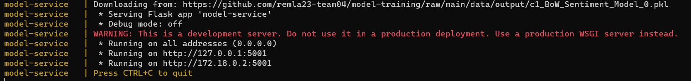

# Model Service

This repo defines the service that allows the frontend app to select a model and perform predictions  
  
### Endpoints
1. Run `model-service.py` and access this service on `http://localhost:5000/`. Alternatively build and run the docker image. Don't forget to map the port in order to access it locally. 
2. Swagger documentation available at `http://localhost:5000/apidocs`.

### Setup
1. Go to this project's root
2. Make a conda environment & activate it
3. Do `pip install -r requirements.txt`

### Running
To run the entire stack you can:
1. Make sure Docker Desktop is running.
2. Go to the root of the `operation` folder(repo).
3. Run `docker compose up`
4. This should download the model on start as can be seen in the image below, or in `src/model-service.py` -> `download` method.

### Endpoints
| Endpoint                                                       | Method | Description                                                          | Example                                                                               |
|----------------------------------------------------------------|--------|----------------------------------------------------------------------|---------------------------------------------------------------------------------------|
| `/`                                                            | Any    | Root endpoint to check if the service is running                     | http://localhost:5000/                                                                |
| `/clean`                                                       | GET    | Removes everything from temp folder and sets up the folder structure | http://localhost:5000/clean                                                           |
| `/download/<classifier_name>/<sentiment_model_name>/<version>` | GET    | Gets trained model from the `model-training` repo                    | http://localhost:5000/download/c2_Classifier_Sentiment_Model/c1_BoW_Sentiment_Model/0 |
| `/submit_review`                                               | POST   | Predicts if a review is positive or negative.                        | See [postman requests](./postman_requests/REMLA.postman_collection.json)              |

